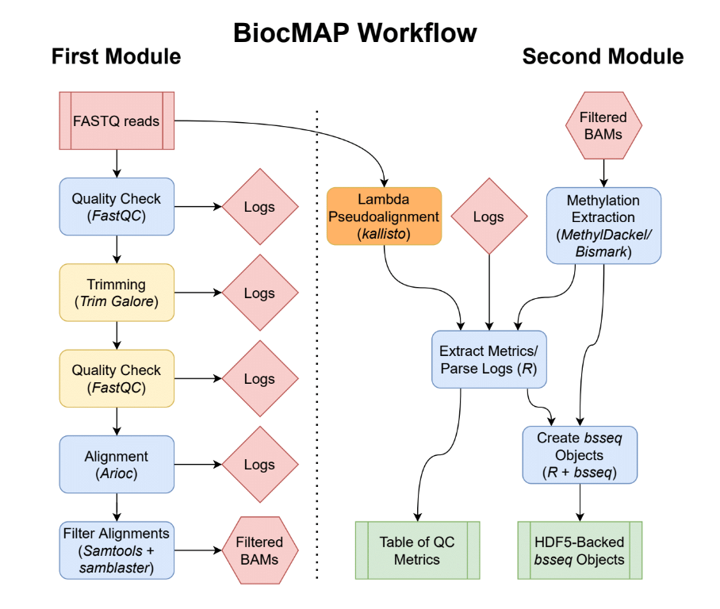

# Pipeline Overview {#pipeline-overview}

*Diagram representing the "conceptual" workflow traversed by BiocMAP. Here some nextflow [`processes`](https://www.nextflow.io/docs/latest/process.html) are grouped together for simplicity; the exact processes traversed are enumerated below. The red box indicates the FASTQ files are inputs to the pipeline; green coloring denotes major output files from the pipeline; the remaining boxes represent computational steps. Yellow-colored steps are optional or not always performed; for example, preparing a particular set of annotation files occurs once and uses a cache for further runs. Finally, blue-colored steps are ordinary processes which occur on every pipeline execution.*

## Preparation Steps

The following processes in the pipeline are done only once for a given configuration, and are skipped on all subsequent runs:

### Downloading and preparing required annotation files ###

- **PullReference**: when using default [annotation](#annotation), this process pulls the genome fasta from [GENCODE](https://www.gencodegenes.org/), possibly subsets to canonical sequences (see [annotation builds](#choosing-build), and saves to the directory specified by `--annotation`. This is the file against which FASTQ reads are aligned, and methylation is extracted.
- **PrepareReference**: when run as part of the first module: split the single FASTA file into individual files (for handling with Arioc) and write the configuration file later used by Arioc to encode these reference files. When run as part of the second module: runs `bismark_genome_preparation` with the `--hisat` option, in preparation for possible methylation extraction using `Bismark` (though note that `MethylDackel` is used instead by default!).
- **EncodeReference**: run `AriocE` to encode reference files for use with the `Arioc` aligner. This process requires a GPU.
* *PrepareLambda* when using the `--with_lambda` [option](#command-opts) as part of the second module, this process downloads the lambda bacteriophage genome and creates kallisto indices required for later estimation of bisulfite conversion efficiency.

## Main Workflow Steps: First Module

- **PreprocessInputs**: Merge FASTQ files where specified in `samples.manifest` and create conveniently named soft links of each FASTQ file for internal use in BiocMAP.
- **FastQC_Untrimmed**: FASTQ files are ran through FastQC as a preliminary quality control measure. By default, the presence of "adapter content" determined in this process decides whether a given sample is trimmed in the next step. See the `--trim_mode` [command option](#command-opts) for modifying this default behavior.
- **Trimming**: See "FastQC_Untrimmed" above- FASTQ inputs are trimmed with `Trim Galore!` either based on adapter content from FastQC, or differently based on the `--trim_mode` [command option]. FastQC is also run as a confirmation step after trimming. For samples that are trimmed, post-trimming FastQC metrics are collected and later gathered into an R data frame; for all other samples, these metrics are collected from the FastQC run prior to any trimming.
- **WriteAriocConfigs**: Generate configurations file for use in `AriocE`, followed by `AriocU` or `AriocP`, using configuration settings specified in [the appropriate config](#quick-config). Note two configuration files are created for each sample.
- **EncodeReads**: Run `AriocE` to encode each sample in preparation for the alignment step with Arioc.
- **AlignReads**: Align each sample to the reference genome using Arioc, creating at least one SAM file.
- **FilterAlignments**: Filter, sort, compress, and index alignments from Arioc. First, primary alignments with a `MAPQ` of at least 5 are kept, and duplicate alignments are removed using `samblaster`. The result is coordinate-sorted, compressed into BAM format, and this BAM file is indexed.
- **MakeRules**: [A `rules.txt` file](#inputs) is created in the same directory as `samples.manifest` so that the second module can be easily run by the user after completion of the first module.

## Main Workflow Steps: Second Module

- **PreprocessInputs**: parse `rules.txt` and `samples.manifest`, the inputs to the second module, so that all relevant FASTQ files and logs may be handled correctly in later steps.
- **LambdaPseudo**: when the `--with_lambda` [option](#command-opts) is specified, pseudoalignment to the lambda bacteriophage transcriptome is performed. Both the (overwhelmingly unmethylated) original transcriptome and then an "in-silico bisulfite-converted" version of the transcriptome are used in series. Successful map rates are used to estimate the entire experiment's bisulfite conversion rate, a metric which is included in the final output R data frame.
- **BME**: when using the `--use_bme` [option](#command-opts), methylation extraction is performed using `bismark_methylation_extraction`.
- **Bismark2Bedgraph**: when using the `--use_bme` [option](#command-opts), the `bismark2bedgraph` utility from Bismark is run to generate intermediate `bedGraph` files, which are later used to generate text-based "cytosine reports".
- **Coverage2Cytosine**: when using the `--use_bme` [option](#command-opts), the `coverage2cytosine` utility from Bismark created text-based "cytosine reports", which are later read into R to produce the final `bsseq` objects.
- **MethylationExtraction**: this process is run by default in place of the above Bismark-related processes, and performs methylation extraction with `MethylDackel`, ultimately generating "cytosine reports" comparable to those produced by the `coverage2cytosine` Bismark utility.
- **ParseReports**: logs from FastQC, any trimming, alignment, methylation extraction, and, if applicable, bisulfite conversion estimation, are parsed to extract key metrics into an R data frame. This data frame is produced as both a standalone `.rda` file, and included as part of the `colData` slots in each of the output `bsseq` objects.
- **FormBsseqObjects**: `bsseq` R objects are formed, one for each canonical chromosome and all samples, from information provided in the "cytosine reports" generated in either the `MethylationExtraction` or `Coverage2Cytosine` process. These are typically considered intermediary files, as the next process merges the many `bsseq` objects from this step into just a pair of final outputs, but for very large experiments, the objects from this step may be more reasonable to work with (to reduce memory requirements).
- **MergeBsseqObjects**: the final process in the pipeline, which combines all previous `bsseq` objects into just two objects- the first containing all cytosines in "CpG" context in the genome, and the other containing those in "CpH" context. The `colData` slot in each of these objects contain the metrics extracted in the `ParseReports` process, some of which might be useful covariates in potential downstream statistical analyses. See [outputs](#outputs) for more information.
