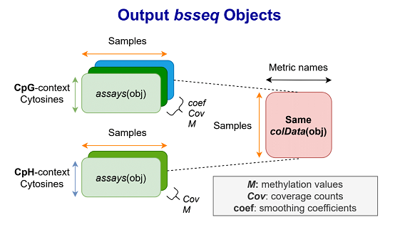

# Outputs {#outputs}

## Main Outputs

The major outputs from the second module are R objects from the [*bsseq* Bioconductor package](https://www.bioconductor.org/packages/release/bioc/vignettes/bsseq/inst/doc/bsseq.html), which contain methylation proportion and coverage information at all cytosine loci in the human genome. bsseq extends the `SummarizedExperiment` class, which provides a general and popular format for storing genomics data. Two `bsseq` objects are produced, with one object containing cytosine sites in CpG context, and the other containing the remaining CpH loci.

### CpG *bsseq* object

We "strand collapse" CpG loci, which involves combining methylation data from both genomic strands (and thus discarding strand-specific information). The object is "smoothed" with the [BSmooth algorithm](https://genomebiology.biomedcentral.com/articles/10.1186/gb-2012-13-10-r83), a process for inferring stable regional estimates of methylation levels. Loci are ordered by genomic position.

### CpH *bsseq* object

We retain strand-specific information for CpH loci. These loci are also ordered by genomic position.

### Storage method

Because all cytosines in the genome are included in the output objects, the data may occupy tens or even hundreds of gigabytes in memory (RAM) if loaded in a typical fashion. To enable working with the objects in a reasonable amount of memory, the assays (in this case methylation fraction and coverage counts) are HDF5-backed using the [HDF5Array R package](https://bioconductor.org/packages/release/bioc/html/HDF5Array.html), based on the [DelayedArray](https://bioconductor.org/packages/release/bioc/html/DelayedArray.html) framework. Essentially, this involves storing the assays in a .h5 file, a format designed to enable working with on-disk data as if it were loaded in RAM.

### Metrics

The `colData` slot of each `bsseq` object includes metrics collected from various processing steps throughout the pipeline. These metrics are also included in a standalone RDA file containing an R data frame whose columns are different quality metrics, and whose rows are associated with sample names. A list of the exact column names and their descriptions is given below.

| Metric Name | Processing step | Description |
| --- | --- | ------ |
| FQCbasicStats | FastQC | Value for "Basic Statistics" in FastQC summary output |
| perBaseQual | FastQC | Value for "Per base sequence quality" in FastQC summary output |
| perTileQual | FastQC | Value for "Per tile sequence quality" in FastQC summary output |
| perSeqQual | FastQC | Value for "Per sequence quality scores" in FastQC summary output |
| perBaseContent | FastQC | Value for "Per base sequence content" in FastQC summary output |
| GCcontent | FastQC | Value for "Per sequence GC content" in FastQC summary output |
| Ncontent | FastQC | Value for "Per base N content" in FastQC summary output |
| SeqLengthDist | FastQC | Value for "Sequence Length Distribution" in FastQC summary output |
| SeqDuplication | FastQC | Value for "Sequence Duplication Levels" in FastQC summary output |
| OverrepSeqs | FastQC | Value for "Overrepresented sequences" in FastQC summary output |
| AdapterContent | FastQC | Value for "Adapter Content" in FastQC summary output |
| KmerContent | FastQC | Value for "Kmer Content" in FastQC summary output |
| Total_reads_processed | Trim Galore! | Value for "Total reads processed" entry in STDOUT from trimming |
| Reads_with_adapters | Trim Galore! | Value for "Reads with adapters" entry in STDOUT from trimming |
| Reads_written_passing_filters | Trim Galore! | Value for "Reads written (passing filters)" entry in STDOUT from trimming |
| Total_basepairs_processed | Trim Galore! | Value for "Total basepairs processed" entry in STDOUT from trimming |
| Quality_trimmed | Trim Galore! | Value for "Quality-trimmed" entry in STDOUT from trimming |
| Total_written_filtered | Trim Galore! | Value for "Total written (filtered)" entry in STDOUT from trimming |
| Sequence | Trim Galore! | Detected adapter sequence when trimming |
| was_trimmed | Trim Galore! | Logical value ("TRUE" or "FALSE") indicating whether this sample was trimmed |
| pairs | Arioc | Total number of pairs present in input data |
| conc_pairs_total | Arioc | Total number of concordantly aligned pairs |
| conc_pairs_1_mapping | Arioc | Number of uniquely mapped concordant alignments |
| conc_pairs_many_mappings | Arioc | Number of non-uniquely mapped concordant pairs |
| disc_pairs | Arioc | Number of pairs that aligned discordantly |
| rejected_pairs | Arioc | Number of pairs that were "rejected" during alignment |
| unmapped_pairs | Arioc | Number of pairs that didn't both successfully map |
| mates_not_in_paired_maps_total | Arioc | Value for "mates not in paired mappings" field in "SAM output" section of verbose output from alignment |
| mates_NIPM_with_no_maps | Arioc | Number of mates not in paired mappings having no mappings |
| mates_NIPM_with_1_map | Arioc | Number of mates not in paired mappings having 1 mapping |
| mates_NIPM_with_many_maps | Arioc | Number of mates not in paired mappings having 2 or more mappings |      
| total_mapped_mates | Arioc | Total number of mates mapped |      
| duplicate_maps | Arioc | Value for "duplicate mappings (unreported)" field in "SAM output" section of verbose output from alignment |      
| maxQlen | Arioc | Value for "maximum Q length" field in "SAM output" section of verbose output from alignment |      
| max_diag_band_width | Arioc | Value for "maximum diagonal band width" field in "SAM output" section of verbose output from alignment |      
| TLEN mean | Arioc | Value for "TLEN mean (stdev, skewness)" field in "SAM output" section of verbose output from alignment |        
| perc_M_CpG | Methylation extraction | Percentage of methylated cytosines appearing in CpG context |      
| perc_M_CHG | Methylation extraction | Percentage of methylated cytosines appearing in CHG context |
| perc_M_CHH | Methylation extraction | Percentage of methylated cytosines appearing in CHH context |
| lambda_bs_conv_eff | Lambda pseudo-alignment | Estimated bisulfite conversion efficiency as a percentage |

## Intermediary Outputs

[INSERT PIPELINE NAME HERE] generates a number of files along the process before producing the main outputs of interest in each module. Each of these "intermediary" files is described below.

### First Module

**Preprocessing Logs** `preprocessing/`

- `preprocess_input_first_half.log`: Information about how the input `samples.manifest` file was parsed to internally handle input files correctly downstream.

**FastQC Outputs** `fastQC/`

- `[trim_status]/[file_name]/*`: Outputs from [FastQC](https://www.bioinformatics.babraham.ac.uk/projects/fastqc/). Here `[trim_status]` indicates when FastQC was performed: `Untrimmed` is before trimming, and `Trimmed` is after. `[file_name]` contains the sample name, and if applicable, the mate number.

**Trimmed FASTQ Files** `trimming/`

- `[sample_name]_trimmed*.fastq`: Trimmed FASTQ files, if applicable, from [Trim Galore](https://www.bioinformatics.babraham.ac.uk/projects/trim_galore/).

**Raw Alignment-related Files** `Arioc/`

- `sams/[sample_name].c.sam`: Concordant alignments output directly from Arioc, in SAM format.
- `configs/[sample_name]_align.cfg`: The exact config file used by Arioc to align reads to the reference genome.
- `configs/[sample_name]_encode.cfg`: The exact config file used by Arioc to encode reads prior to alignment to the reference genome.
- `logs/*_[sample_name].log`: Logs from encoding and aligning samples with Arioc.

**Filtered Alignments** `FilteredAlignments/bams`

- `[sample_name].cfu.sorted.bam` and `[sample_name].cfu.sorted.bam.bai`: Coordinate-sorted, quality-filtered (only including alignments with `MAPQ` >= 5), unique (duplicate mappings removed) alignments in BAM format, with a corresponding BAM index.

### Second Module

**Preprocessing Logs** `preprocessing/`

- `preprocess_input_second_half.log`: Information about how the input `rules.txt` file was parsed to internally handle input files correctly downstream.

**Lambda-based Bisulfite-Conversion Estimatation** `lambda/`

- `[sample_name]_lambda_pseudo.log`: (For experiments with lambda spike-ins, using the `--with_lambda` [option](#command-opts)) Logs containing a percentage estimate for the bisulfite-conversion efficiency for each sample, based on pseudo-aligning input FASTQs to both the lambda bacteriophage transcriptome and an "*in silico* bisulfite-converted copy" of the transcriptome, and comparing alignment rates.

**Bismark Methylation Extractor Outputs** `BME/`

- `[sample_name]/*`: (When using the `--use_bme` [option](#command-opts)) Files output from running `bismark_methylation_extractor`, including compressed text-based methylation information, a splitting report, and an "M-bias" report.

**Cytosine Reports and Bedgraphs** `Reports/`

- `[sample_name]/[sample_name].*.CX_report.txt`: "Cytosine reports" containing methylation counts and context for every cytosine in the genome, split by chromosome. By default, these are generated with `MethylDackel`, or otherwise with `coverage2cytosine` from the `Bismark` software suite when using the `--use_bme` [option](#command-opts).

- `[sample_name]/[sample_name]_bedgraph_merged*.gz`: (When using the `--use_bme` [option](#command-opts)) A `bedgraph` file containing positional and methylation information for each cytosine; a "coverage" file containing similar information. See [Bismark's documentation](https://rawgit.com/FelixKrueger/Bismark/master/Docs/Bismark_User_Guide.html#appendix-iii-bismark-methylation-extractor) for more detail.

**Individual *bsseq* objects** `BSobjects/objects/`

- `[chromosome]/[context]/*`: R objects containing either cytosines in "CpG" or "CpH", for a single chromosome. While the [final bsseq objects](#main-outputs) are combined across all chromosomes for convenience, it may be more practical in some cases to work with these individual objects, which are significantly smaller in memory.
