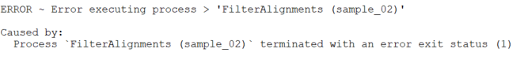

# Help {#help}

## Common Errors

[INSERT PIPELINE NAME HERE] should be configured so that fundamental issues related to pipeline function do not arise. If you encounter an error and believe it to be a design flaw in [INSERT PIPELINE NAME HERE], you can always [submit a github issue](https://github.com/LieberInstitute/[INSERT PIPELINE NAME HERE]/issues). However, please take a look at the following common issues:

* *A job/ process is not given enough memory or time*: pipeline runs on large samples or datasets may require more memory or a higher time limit. When reported correctly, the pipeline will indicate an error status of 140 (for SGE or SLURM environments); however, memory issues can take many forms, and related error messages are not always clear. In this example case, the process FilterAlignments failed due to insufficient memory, but indicated a general error status (1):



Attempt to provide the process more memory in your config. In this case the configuration for FilterAlignments looks like this (for SGE users):

```{groovy, eval=FALSE}
withName: FilterAlignments {
    cpus = 2
    penv = 'local'
    memory = 16.GB
    clusterOptions = '-l h_fsize=800G'
}
```

Note that disk space may also be the limitation. See the [configuration](#configuration) section for more info.

* *Nextflow has trouble communicating with your cluster*: a less common issue can occur on slower clusters, related to nextflow failing to poll your grid scheduler (like SGE or SLURM) for information it needs about the jobs that are running. This can show up in an error message like: `Process `FilterAlignments (Prefix: Sample_FE2P1_blood)` terminated for an unknown reason -- Likely it has been terminated by the external system`. We have found that raising the `exitReadTimeout` to a large value (such as 40 minutes) solves this issue, but consider raising it further if needed.

```{groovy, eval=FALSE}
executor {
    name = 'sge'
    queueSize = 40
    submitRateLimit = '1 sec'
    exitReadTimeout = '40 min'
}
```

## Resuming {#resuming}

An important feature of [INSERT PIPELINE NAME HERE] (because it is based on nextflow) is the ability to resume pipeline execution if an error occurs for any reason. To resume, you must add the `-resume` flag to your "main" script, determined [here](#your-main-script), and rerun. Otherwise, the default is to restart the entire pipeline, regardless of how much progress was made!


## Docker help

For those who wish to use [docker](https://www.docker.com/) to manage [INSERT PIPELINE NAME HERE] software dependencies, we provide a brief set-up guide.

1. **Install docker**

A set of instructions for different operating systems are available on the [Docker site](https://docs.docker.com/installation/).

2. **Create a docker group**

```{bash, eval=FALSE}
sudo addgroup docker
```

3. **Add user to docker group**

```{bash, eval=FALSE}
sudo usermod -aG docker <your_user>
```

4. **Checking installation**

Log out and log back in to ensure your user is running with the correct permissions.

[Test Docker installation](https://docs.docker.com/get-started/#test-docker-installation) by running:

```{bash, eval=FALSE}
docker run hello-world
```
